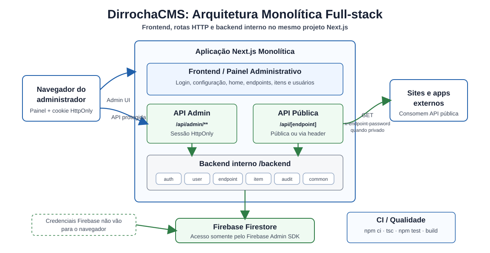

<p align="center">
  
</p>

<h1 align="center">DirrochaCMS</h1>

<p align="center">
  <strong>English</strong> · <a href="./README.pt-BR.md">Português (Brasil)</a>
</p>

A lightweight CMS for creating dynamic HTTP endpoints and managing their content, built with Next.js, React and Firebase.

<p>
  
  
  
  
  
</p>

DirrochaCMS is aimed at projects that need a simple, editable API without building an admin area from scratch. Through the admin panel you create a route, define the fields of that endpoint, and manage its records from the interface.

> **Documentation status.** This documentation and the material under `paper/` and `docs/` are a
> working draft under active revision, not a final version. Wording, structure and some claims
> are still being reviewed. Corrections are welcome through an
> [issue](https://github.com/marco0antonio0/DirrochaCMS/issues).

## Contents

- [Features](#features)
- [Screenshots](#screenshots)
- [Stack](#stack)
- [Architecture](#architecture)
- [Project Structure](#project-structure)
- [Running Locally](#running-locally)
- [Firebase Admin Credential](#firebase-admin-credential-service-account)
- [Environment Variables](#environment-variables)
- [Running in Production](#running-in-production)
- [Main Routes](#main-routes)
- [Usage](#usage)
- [API](#api)
- [Development](#development)
- [Academic Use and JOSS Submission](#academic-use-and-joss-submission)
- [Changelog](#changelog)
- [Contributing](#contributing)
- [Code of Conduct](#code-of-conduct)
- [Security](#security)
- [License](#license)

## Features

- Create custom endpoints through the interface.
- Field builder with free-form names and categorized types.
- Drag-and-drop field ordering.
- Automatically generated `titulo_identificador` (slug) field.
- List, search, create, edit and delete records from the panel.
- Confirmation dialog for deletions.
- JWT authentication with a persisted, revocable session.
- Self-hosted anti-bot protection with ALTCHA on login and first-account creation.
- Role-based account management (`admin` / `editor` / `viewer`), including password changes, deactivation and deletion.
- Persistence with Firebase Firestore.
- Next.js App Router interface.
- Backend organized by module under `/backend`.
- Dockerfile for containerized builds.

## Screenshots

Login screen:


Content panel, listing the created endpoints:


## Stack

- Next.js 15
- React 19
- TypeScript
- Tailwind CSS
- Radix UI
- HeroUI
- Firebase Firestore (through the Firebase Admin SDK, server-side only)
- jose (session tokens)
- bcryptjs
- Docker

## Architecture

DirrochaCMS uses a monolithic full-stack architecture: the administrative
frontend, HTTP API routes, and internal backend modules live in the same Next.js
application. Firestore remains external and is accessed only from the server
through the Firebase Admin SDK.



## Project Structure

```text
DirrochaCMS/
├── app/
│   ├── api/
│   │   ├── [id]/            # Public API of an endpoint (the only anonymous route)
│   │   └── admin/           # Panel API, protected by session
│   ├── components/          # UI components
│   ├── hooks/               # Hooks (e.g. session identity)
│   ├── pages/               # Screen implementations
│   ├── services/            # Panel HTTP client (adminApi)
│   ├── styles/              # Global styles
│   └── utils/               # Frontend utilities
├── backend/                 # Server-only (marked with `server-only`)
│   ├── audit/
│   ├── auth/
│   ├── endpoint/
│   ├── history/
│   ├── item/
│   ├── sessao/
│   ├── user/
│   ├── common/              # Authorization guard, tokens, API errors
│   └── config/              # Admin SDK initialization
├── docs/                    # Verification guide and JOSS material
├── examples/                # Documented use cases
├── paper/                   # JOSS paper
├── middleware.ts            # Redirects visitors without a session
├── firestore.rules          # Firestore rules (deny-all)
├── images/                  # Images used in the documentation
├── public/                  # Public assets
├── Dockerfile
├── package.json
├── README.md                # English documentation
└── README.pt-BR.md          # Portuguese documentation
```

The data flow is always the same:

```text
client component → app/services/adminApi.ts (fetch + HttpOnly cookie)
    → app/api/admin/**/route.ts → withAuth (authorization)
        → backend/<module>/service.ts → repository.ts → Firestore (Admin SDK)
```

Each backend domain follows the same layout:

```text
backend/<module>/
├── <module>.service.ts
├── <module>.repository.ts
├── <module>.entity.ts
└── <module>.model.ts
```

Main responsibilities:

- `service.ts`: business rules and validation.
- `repository.ts`: Firestore access. Never returns secret material (passwords, hashes).
- `entity.ts`: constants, defaults and domain contracts.
- `model.ts`: TypeScript types of the domain.

Nothing under `backend/` may be imported by a client component: the files are marked with
`server-only`, which turns any such attempt into a build error.

## Running Locally

### Prerequisites

- Node.js 18 or newer.
- npm.
- A Firebase account/project with Firestore enabled.
- A Firebase Admin **service account** (instructions below).

### Step by step

1. Clone the repository:

```bash
git clone https://github.com/marco0antonio0/DirrochaCMS.git
cd DirrochaCMS
```

2. Install the dependencies:

```bash
npm install
```

3. Create the environment file:

```bash
cp .env.example .env
```

4. Generate the Firebase Admin credential and fill in `.env`. See
   [Firebase Admin Credential](#firebase-admin-credential-service-account).

5. Start the development server:

```bash
npm run dev
```

6. Open:

```text
http://localhost:3000
```

On first access, the application guides you through creating the administrator account.

## Firebase Admin Credential (service account)

The CMS accesses Firestore **from the server only**, using the Firebase Admin SDK. No Firebase
credential is ever sent to the browser, and the Firestore security rules stay closed
(`deny-all`): the Admin SDK bypasses them by design.

That is why a service account is required. It replaces the former `NEXT_PUBLIC_FIREBASE_*`
variables, which are no longer used.

### 1. Get the JSON file

1. Open the [Firebase Console](https://console.firebase.google.com/) and select your project.
2. In the sidebar, click **Settings** ⚙️ and then **Service accounts**.

   

3. With **Firebase Admin SDK** selected, keep *Node.js* checked and click
   **Generate new private key**.

   

4. Confirm with **Generate key**. The download starts: a file similar to
   `your-project-firebase-adminsdk-xxxxx-abc123.json`.

> This file is a **private key** with full access to your database. Treat it like a password:
> never commit it, never paste it into a chat or issue, and delete the local copy once
> configured. If it leaks, revoke it under *Service accounts → Manage service account
> permissions*.

### 2. Convert it to base64

The raw JSON cannot go into `.env`: the `private_key` field contains newlines (`\n`), which
breaks `.env` parsing and causes *invalid PEM* errors in deployment dashboards. Encoding it as
base64 fits everything on a single line.

Linux:

```bash
base64 -w0 ~/Downloads/your-project-firebase-adminsdk-xxxxx.json
```

macOS (no `-w0` flag available):

```bash
base64 -i ~/Downloads/your-project-firebase-adminsdk-xxxxx.json | tr -d '\n'
```

Windows (PowerShell):

```powershell
[Convert]::ToBase64String([IO.File]::ReadAllBytes("$HOME\Downloads\your-project-firebase-adminsdk-xxxxx.json"))
```

Copy the entire output (one long line, no spaces).

### 3. Generate `SECRET_KEY`

`SECRET_KEY` signs the session tokens. It must be **at least 32 characters**: the application
refuses to start with a shorter value. The project ships a command for this that works on any
operating system:

```bash
npm run generate:secret
```

Output (example — generate your own, do not copy this one):

```text
PdAEEgNHGCtuztFMFrGr6qk+Mnh4CpwbrmxIAWtV5jxYd3wSZo/j0Oic+/AtsR1J
```

Equivalent alternatives, if you prefer not to use npm:

```bash
openssl rand -base64 48
node -e "console.log(require('crypto').randomBytes(48).toString('base64'))"
```

> Use a **different** value in each environment (development, staging, production).
> Changing `SECRET_KEY` invalidates every active session and forces a new login.

### 4. Put it in `.env`

```env
FIREBASE_SERVICE_ACCOUNT_B64=eyJ0eXBlIjoic2VydmljZV9hY2NvdW50IiwicHJvamVjdF9pZCI6...
SECRET_KEY=PdAEEgNHGCtuztFMFrGr6qk+Mnh4CpwbrmxIAWtV5jxYd3wSZo/j0Oic+/AtsR1J
NEXT_PUBLIC_ENV=development
```

Shortcut to write both variables without printing the secrets to the terminal:

```bash
printf 'FIREBASE_SERVICE_ACCOUNT_B64=%s\n' \
  "$(base64 -w0 ~/Downloads/your-project-firebase-adminsdk-xxxxx.json)" >> .env

printf 'SECRET_KEY=%s\n' "$(npm run generate:secret --silent)" >> .env
```

### 5. Verify and clean up

Confirm the variable decodes correctly:

```bash
node -e 'require("fs").readFileSync(".env","utf8").split("\n").forEach(l=>{const i=l.indexOf("=");if(i>0)process.env[l.slice(0,i)]=l.slice(i+1)});
const j=JSON.parse(Buffer.from(process.env.FIREBASE_SERVICE_ACCOUNT_B64,"base64").toString());
console.log("OK - project:", j.project_id)'
```

Then delete the downloaded JSON, since the key already lives in `.env`:

```bash
shred -u ~/Downloads/your-project-firebase-adminsdk-xxxxx.json
```

> The service account's `project_id` must match the **same** project as the database you intend
> to use. If they differ, the application still starts but talks to a different Firestore.

### 6. Close the Firestore rules

With every data access happening on the server, the rules can (and should) deny everything.
The [`firestore.rules`](./firestore.rules) file already ships in that state:

```bash
npx firebase login
npx firebase deploy --only firestore:rules
```

Without this step, the database remains reachable by anyone who knows the project ID.

### Common errors

| Message | Cause |
| --- | --- |
| `FIREBASE_SERVICE_ACCOUNT_B64 ausente` | Variable not set in `.env` or in the deployment environment. |
| `FIREBASE_SERVICE_ACCOUNT_B64 nao contem um JSON valido em base64` | Truncated base64, or base64 containing newlines. Redo it with `-w0` (or `tr -d '\n'`). |
| `Service account invalida: campo "private_key" ausente` | The wrong file was encoded (e.g. the mobile app's `google-services.json`, which is not a service account). |
| `SECRET_KEY ausente ou curta demais` | `SECRET_KEY` missing or shorter than 32 characters. |

## Environment Variables

There are only three variables. None of them is exposed to the browser, except `NEXT_PUBLIC_ENV`.

| Variable | Required | Description |
| --- | --- | --- |
| `FIREBASE_SERVICE_ACCOUNT_B64` | Yes | Firebase Admin service account JSON, base64-encoded on a single line. See [how to obtain it](#firebase-admin-credential-service-account). |
| `SECRET_KEY` | Yes | Signs the session tokens (HMAC). Minimum of 32 characters — generate one with `npm run generate:secret`. Changing the value invalidates every active session. |
| `NEXT_PUBLIC_ENV` | No | Current environment, for example `development` or `production`. |

Example:

```env
FIREBASE_SERVICE_ACCOUNT_B64=eyJ0eXBlIjoic2VydmljZV9hY2NvdW50IiwicHJvamVjdF9pZCI6...
SECRET_KEY=change_this_to_a_strong_random_secret_min_32_chars
NEXT_PUBLIC_ENV=development
```

The application **fails to start** if `FIREBASE_SERVICE_ACCOUNT_B64` is missing or invalid, or
if `SECRET_KEY` is shorter than 32 characters. This is intentional: a misconfiguration is
detected at boot instead of silently during a request.

> **Migrating from an earlier version:** the `NEXT_PUBLIC_FIREBASE_*` variables were removed.
> All Firestore access moved to the server through the Admin SDK, so the browser no longer
> receives any credential. Replace them with `FIREBASE_SERVICE_ACCOUNT_B64` and deploy the
> rules in [`firestore.rules`](./firestore.rules).

## Running in Production

### Local build

```bash
npm run build
npm run start
```

The application listens on `http://localhost:3000`.

### Docker

```bash
docker build -t dirrochacms .
docker run --env-file .env -p 3000:3000 dirrochacms
```

### Deploying to Vercel or your own server

Configure the same variables from `.env` in the production environment and use the standard
Next.js build flow:

```bash
npm install
npm run build
npm run start
```

On Vercel, add them under *Settings → Environment Variables*:

- `FIREBASE_SERVICE_ACCOUNT_B64` — the same base64 string from `.env`. Being a single line, it
  pastes cleanly into the dashboard.
- `SECRET_KEY` — use a value **different** from the development one.

Do not mark these variables as public: they carry no `NEXT_PUBLIC_` prefix, so they stay on the
server.

## Main Routes

| Route | Description |
| --- | --- |
| `/` | Login and initial setup. |
| `/home` | Lists the endpoints. |
| `/home/[id]` | Manages the records of an endpoint. |
| `/configuration` | Creates endpoints and administers panel accounts. |
| `/api/[id]` | Public read API for an endpoint's data. Can be public or password-protected. |

Administrative routes (require a session; the cookie is `HttpOnly` and sent automatically):

| Route | Method | Description |
| --- | --- | --- |
| `/api/admin/auth/login` | POST | Authenticates and sets the session cookie. |
| `/api/admin/auth/logout` | POST | Ends the session and revokes the token. |
| `/api/admin/auth/me` | GET | Identity and permissions of the current session. |
| `/api/admin/auth/setup` | GET, POST | Initial setup state and creation of the first administrator. |
| `/api/admin/endpoints` | GET, POST | Lists and creates endpoints. |
| `/api/admin/endpoints/[id]` | GET, PATCH, DELETE | Reads, updates and deletes an endpoint (along with its records and history). |
| `/api/admin/endpoints/[id]/cache-refresh` | POST | Invalidates the endpoint cache. |
| `/api/admin/endpoints/[id]/items` | GET, POST | Lists and creates records. |
| `/api/admin/endpoints/[id]/items/[itemId]` | PATCH, DELETE | Updates and deletes a record. |
| `/api/admin/endpoints/[id]/history` | GET | Change history of the endpoint. |
| `/api/admin/users` | GET, POST | Lists and creates accounts. Requires the account-management permission. |
| `/api/admin/users/[userId]` | PATCH, DELETE | Updates and deletes accounts. Requires the account-management permission. |

The `/api/login`, `/api/register`, `/api/user/*` and `/api/verifyToken` routes were removed and
now answer `410 Gone`, pointing to their replacement.

## Usage

### Creating an endpoint

1. Go to `/configuration`.
2. Enter the route name, for example `posts`.
3. Add fields in the builder.
4. Choose the type of each field:
   - `Texto` (text)
   - `Numero` (number)
   - `Data` (date)
   - `Imagem` (image)
5. Drag the fields to adjust their order.
6. Use `Multi-Linha` (multiline) only on text fields.
7. Click `Criar endpoint`.

The `titulo_identificador` field does not need to be declared. It is created automatically.

### Managing records

1. Go to `/home`.
2. Click the desired endpoint.
3. Create new records.
4. Edit existing records.
5. Delete records with the delete button and confirm in the dialog.

### Configuring endpoint access

1. Go to `/home`.
2. Click the desired endpoint.
3. Open the settings dialog with the gear button.
4. Under `Acesso da API` (API access), choose between:
   - `Público` (public): any client can query `/api/endpoint_name`.
   - `Privado` (private): the API requires a password in the `x-endpoint-password` header.
5. When choosing `Privado`, type a password manually or use `Randomizar` to generate a strong
   one. The value is shown once and stored as an HMAC, so copy it before closing the dialog.
6. Save the changes.

Existing endpoints stay public by default until they are switched to `Privado`.

### Managing users

1. Go to `/configuration`.
2. Under `Contas do painel` (panel accounts), fill in name, e-mail, password and role to create
   an account.
3. Use `Editar` to change the name, e-mail, role, or set a new password.
4. Use `Desativar` to block access without deleting the account.
5. Use `Excluir` to remove an account permanently.

Roles and capabilities:

| Role | Read | Write | Delete | Manage accounts |
| --- | :---: | :---: | :---: | :---: |
| `admin` | yes | yes | yes | yes |
| `editor` | yes | yes | yes | no |
| `viewer` | yes | no | no | no |

## API

After creating an endpoint named `posts`, its records can be queried with:

```bash
curl http://localhost:3000/api/posts
```

Response:

```json
{
  "data": [
    {
      "id": "abc123",
      "endpointId": "endpoint-id",
      "formattedData": {
        "titulo": "First post",
        "titulo_identificador": "first-post"
      },
      "createdAt": "2026-07-23T00:00:00.000Z"
    }
  ],
  "statusCode": 200
}
```

Searching by `titulo_identificador`:

```bash
curl "http://localhost:3000/api/posts?t=first-post"
```

If the endpoint is private, send the password in the `x-endpoint-password` header:

```bash
curl http://localhost:3000/api/posts \
  -H "x-endpoint-password: YOUR_PASSWORD"
```

Searching a private endpoint:

```bash
curl "http://localhost:3000/api/posts?t=first-post" \
  -H "x-endpoint-password: YOUR_PASSWORD"
```

Never send passwords in the URL or query string.

### Authentication

The session lives in an `HttpOnly` cookie set by the server. There is no token for the client to
handle, so there is no `Authorization` header; with `curl`, use a cookie jar.

Log in (stores the cookie in `cookies.txt`):

```bash
curl -c cookies.txt -X POST http://localhost:3000/api/admin/auth/login \
  -H "Content-Type: application/json" \
  -d '{"email":"admin@example.com","password":"your-strong-password"}'
```

Use the session:

```bash
curl -b cookies.txt http://localhost:3000/api/admin/auth/me
```

Log out (revokes the session on the server, not just clears the cookie):

```bash
curl -b cookies.txt -X POST http://localhost:3000/api/admin/auth/logout
```

Create the first administrator, while the panel still has no accounts:

```bash
curl http://localhost:3000/api/admin/auth/setup   # {"needsSetup":true,...}

curl -c cookies.txt -X POST http://localhost:3000/api/admin/auth/setup \
  -H "Content-Type: application/json" \
  -d '{"name":"Admin","email":"admin@example.com","password":"your-strong-password"}'
```

Behavioral notes:

- State-changing requests validate `Sec-Fetch-Site`, falling back to `Origin` against `Host`
  (CSRF protection).
- Login attempts are rate-limited per account and per IP address.
- Deactivating or deleting an account revokes its sessions immediately.
- Changing an account's password also terminates its existing sessions.
- Passwords must be at least 10 characters and are rejected if they appear in a common-password
  list.

## Development

Useful commands:

```bash
npm run dev               # development server
npm run build             # production build
npm run start             # serve the build
npm run lint              # lint
npm run generate:secret   # generate a valid SECRET_KEY (48 random bytes, base64)
npm test                  # automated tests
npx tsc --noEmit          # type checking
```

Before opening a pull request:

1. Run `npx tsc --noEmit`.
2. Run `npm test`.
3. Run `npm run build`.
4. Manually exercise the flows you changed — see
   [`docs/manual-verification.md`](./docs/manual-verification.md).
5. Update the documentation if you change routes, variables or public behavior.

Continuous integration runs `npm ci`, `npx tsc --noEmit`, `npm test` and
`npm run build` on every push and pull request
([`.github/workflows/ci.yml`](./.github/workflows/ci.yml)).

## Academic Use and JOSS Submission

DirrochaCMS is being prepared for submission to the Journal of Open Source Software (JOSS),
framed as a lightweight serverless backend architecture for small research and teaching
applications.

| File | Purpose |
| --- | --- |
| [`paper/paper.md`](./paper/paper.md) | JOSS paper (English, the submitted version). |
| [`paper/paper.ptbr.md`](./paper/paper.ptbr.md) | Portuguese version of the paper. |
| [`paper/paper.bib`](./paper/paper.bib) | Bibliography. |
| [`CITATION.cff`](./CITATION.cff) | Citation metadata. |
| [`docs/joss-readiness.md`](./docs/joss-readiness.md) | Submission plan and detailed case-study records. |
| [`docs/joss-readiness.ptbr.md`](./docs/joss-readiness.ptbr.md) | Portuguese version of the submission plan. |
| [`docs/manual-verification.md`](./docs/manual-verification.md) | Manual verification checklist for reviewers. |
| [`docs/manual-verification.ptbr.md`](./docs/manual-verification.ptbr.md) | Portuguese version of the manual verification checklist. |
| [`examples/`](./examples) | Documented use cases (see below). |

Three documented use cases:

- [`examples/research-group-backend`](./examples/research-group-backend) — a UFPA research group
  used DirrochaCMS to publish project and semester-planning information on a web platform.
  Reported at a high level only, since it was a third-party deployment.
- [`examples/osteoplay-vet`](./examples/osteoplay-vet) — OsteoPlay Vet, a veterinary medicine
  capstone project (TCC) at UNAMA Parque Shopping, Belém, Pará, Brazil. A React/Vite educational
  game consumed a DirrochaCMS backend of 6 endpoints and 66 records.
- [`examples/charmosinha-makeapi`](./examples/charmosinha-makeapi) — a classroom demonstration
  for computer science students in a software engineering course, run under the codename MakeAPI.
  A Next.js storefront consumed a backend of 4 endpoints and 19 records. All content is
  fictional and was used solely for teaching.

Full participant credits, observed endpoint schemas and record counts are recorded in
[`docs/joss-readiness.md`](./docs/joss-readiness.md).

If you use DirrochaCMS in academic work, please cite it using the metadata in
[`CITATION.cff`](./CITATION.cff).

## Changelog

Release notes are maintained in [`CHANGELOG.md`](./CHANGELOG.md).

## Roadmap

Ideas that fit the project:

- Automated tests for the backend and the routes.
- Generated visual API documentation per endpoint.
- Data import and export.
- Per-endpoint permissions.
- Endpoint templates for common cases.

## Contributing

Contributions are welcome. Read [CONTRIBUTING.md](./CONTRIBUTING.md) before opening an issue or a
pull request. Issues and pull requests may be written in English or Portuguese.

The repository includes templates for bug reports, feature requests and pull requests under
[`.github/`](./.github).

Recommended flow:

1. Open an issue describing the problem or proposal.
2. Fork the project.
3. Create a branch with a clear name, such as `feature/field-builder` or `fix/login`.
4. Implement the change.
5. Run the checks.
6. Open a pull request with context, screenshots when UI is involved, and testing steps.

**Getting help.** For questions about installing or using DirrochaCMS, open a
[GitHub issue](https://github.com/marco0antonio0/DirrochaCMS/issues) using the bug report or
feature request template — that is the project's support channel, and answers stay searchable
for other users.

## Code of Conduct

This project follows the policy documented in [CODE_OF_CONDUCT.md](./CODE_OF_CONDUCT.md). We
expect respect, clarity and constructive collaboration in issues, pull requests and discussions.

## Security

For vulnerabilities, do not open a public issue containing exploitable details. Follow the
guidance in [SECURITY.md](./SECURITY.md).

How data access works:

- Every Firestore access happens on the server, through the Firebase Admin SDK. The browser
  receives no credential and never talks to Firestore.
- The Firestore rules are `deny-all` ([`firestore.rules`](./firestore.rules)). Since the Admin
  SDK bypasses rules, this does not affect the application, and it blocks any direct access.
- Authorization is enforced on the server on every request: token signature, active session
  (which makes revocation possible), account not disabled, and the account's role capabilities.
- The session uses an `HttpOnly` + `SameSite=Lax` cookie, plus a same-site check on writes.
- Login and first-account creation require ALTCHA. The challenge is generated and validated by
  the server itself using `SECRET_KEY`, with no third-party keys or calls.
- Login is rate-limited per account and per IP address; the public API is rate-limited per IP and
  route.
- The private-endpoint password is stored as an HMAC-SHA256 digest and is never returned by the
  API.
- Record payloads are validated against the endpoint's declared fields, with size limits and
  rejection of prototype-polluting keys.
- Authorship (`createdBy`/`updatedBy`) is derived from the session on the server, so it cannot be
  forged by the client, and it is stripped from the public API response.
- Account and endpoint mutations are recorded in an audit log.

Good practices when using the project:

- Do not commit `.env` or the service account JSON (`.gitignore` already covers both).
- Use a strong, per-environment `SECRET_KEY` (`npm run generate:secret`).
- Deploy the rules (`npx firebase deploy --only firestore:rules`) before exposing the project
  publicly.
- If the service account leaks, revoke the key in *Firebase Console → Service accounts → Manage
  keys* and generate a new one.

## License

Distributed under the MIT license. See [LICENSE](./LICENSE) for details.

## Author

Developed by [@marco0antonio0](https://github.com/marco0antonio0).
