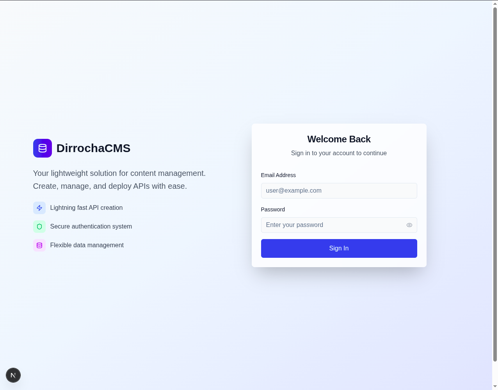
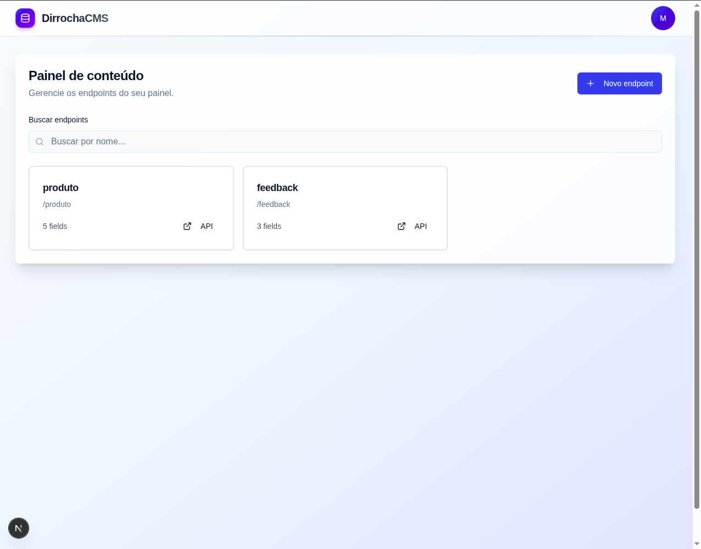
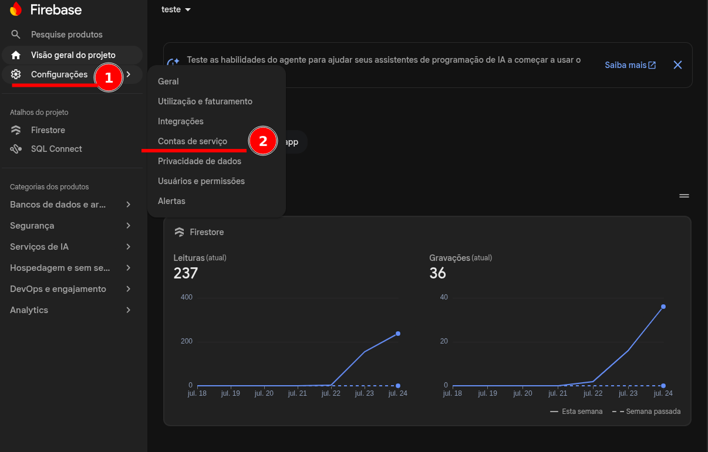
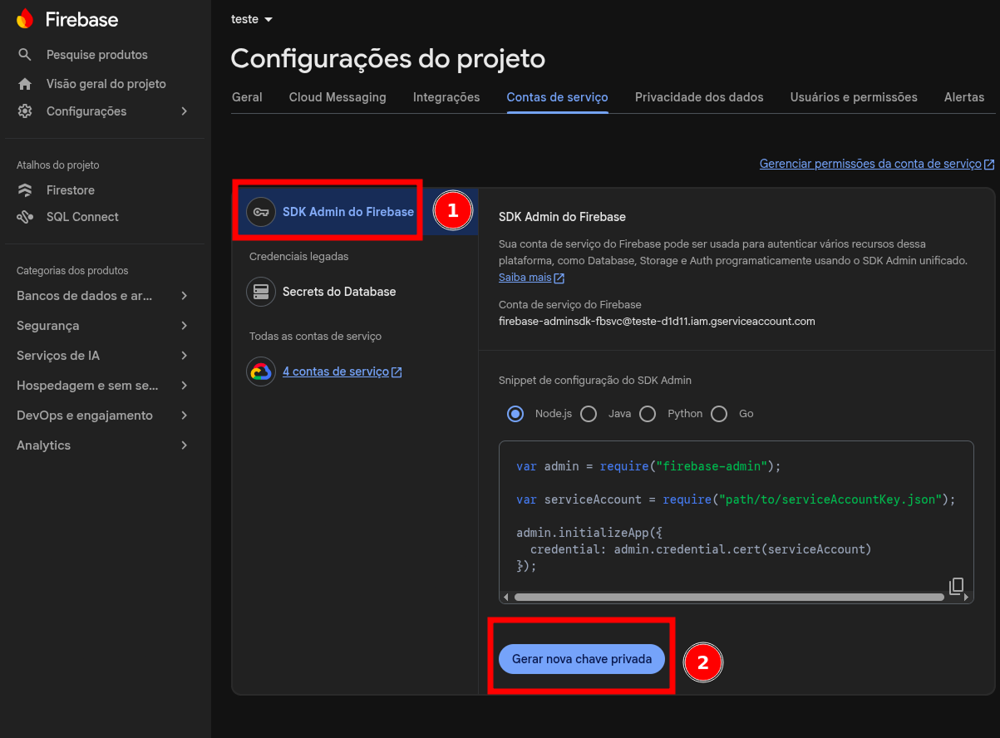

<p align="center">
  
</p>

<h1 align="center">DirrochaCMS</h1>

CMS leve para criar endpoints dinâmicos e gerenciar conteúdo usando Next.js, React e Firebase.

<p>
  
  
  
  
  
</p>

O DirrochaCMS foi pensado para projetos que precisam de uma API simples e editável sem criar uma área administrativa do zero. Pelo painel, você cria uma rota, define os campos daquele endpoint e passa a gerenciar registros pela interface.

## Conteúdo

- [Principais Recursos](#principais-recursos)
- [Capturas de Tela](#capturas-de-tela)
- [Stack](#stack)
- [Estrutura do Projeto](#estrutura-do-projeto)
- [Como Rodar Localmente](#como-rodar-localmente)
- [Credencial do Firebase Admin](#credencial-do-firebase-admin-service-account)
- [Variaveis de Ambiente](#variaveis-de-ambiente)
- [Rodando em Producao](#rodando-em-producao)
- [Rotas Principais](#rotas-principais)
- [Como Usar](#como-usar)
- [API](#api)
- [Desenvolvimento](#desenvolvimento)
- [Contribuicao](#contribuicao)
- [Codigo de Conduta](#codigo-de-conduta)
- [Seguranca](#seguranca)
- [Licenca](#licenca)

## Principais Recursos

- Criação de endpoints personalizados por interface.
- Builder de campos com nomes livres e tipos categorizados.
- Ordenação dos campos por arrastar e soltar.
- Campo `titulo_identificador` gerado automaticamente.
- Listagem, busca, criação, edição e remoção de registros no painel.
- Modal de confirmação para exclusões.
- Autenticação com JWT e sessão persistida.
- Proteção anti-bot self-hosted com ALTCHA no login e na criação da primeira conta.
- Gestão administrativa de contas do painel, com criação, alteração de senha, desativação e exclusão.
- Persistência com Firebase Firestore.
- Interface em Next.js App Router.
- Backend organizado por módulos em `/backend`.
- Dockerfile para build e execução em container.

## Capturas de Tela

Tela de login:



Painel de conteúdo, com os endpoints criados:



## Stack

- Next.js 15
- React 19
- TypeScript
- Tailwind CSS
- Radix UI
- HeroUI
- Firebase Firestore (via Firebase Admin SDK, somente no servidor)
- jose (tokens de sessão)
- bcryptjs
- Docker

## Estrutura do Projeto

```text
DirrochaCMS/
├── app/
│   ├── api/
│   │   ├── [id]/            # API pública de um endpoint (única rota anônima)
│   │   └── admin/           # API do painel, protegida por sessão
│   ├── components/          # Componentes de UI
│   ├── hooks/               # Hooks (ex.: identidade da sessão)
│   ├── pages/               # Implementações das telas
│   ├── services/            # Cliente HTTP do painel (adminApi)
│   ├── styles/              # Estilos globais
│   └── utils/               # Utilitários do frontend
├── backend/                 # Somente servidor (marcado com `server-only`)
│   ├── auth/
│   ├── endpoint/
│   ├── history/
│   ├── item/
│   ├── sessao/
│   ├── user/
│   ├── common/              # Guard de autorização, tokens, erros de API
│   └── config/              # Inicialização do Admin SDK
├── middleware.ts            # Redireciona visitantes sem sessão
├── firestore.rules          # Regras do Firestore (deny-all)
├── images/                  # Imagens usadas na documentação
├── public/                  # Arquivos públicos
├── Dockerfile
├── package.json
└── README.md
```

O fluxo de dados é sempre o mesmo:

```text
componente client → app/services/adminApi.ts (fetch + cookie HttpOnly)
    → app/api/admin/**/route.ts → withAuth (autorização)
        → backend/<modulo>/service.ts → repository.ts → Firestore (Admin SDK)
```

Cada domínio do backend segue a organização:

```text
backend/<modulo>/
├── <modulo>.service.ts
├── <modulo>.repository.ts
├── <modulo>.entity.ts
└── <modulo>.model.ts
```

Responsabilidades principais:

- `service.ts`: regras de negócio e validação.
- `repository.ts`: acesso ao Firestore. Nunca devolve material secreto (senhas, hashes).
- `entity.ts`: constantes, defaults e contratos de domínio.
- `model.ts`: tipos TypeScript do domínio.

Nada em `backend/` pode ser importado por um componente client: os arquivos são marcados
com `server-only`, o que transforma qualquer tentativa em erro de build.

## Como Rodar Localmente

### Pré-requisitos

- Node.js 18 ou superior.
- npm.
- Uma conta/projeto no Firebase com Firestore habilitado.
- Uma **service account** do Firebase Admin (instruções abaixo).

### Passo a passo

1. Clone o repositório:

```bash
git clone https://github.com/marco0antonio0/DirrochaCMS.git
cd DirrochaCMS
```

2. Instale as dependências:

```bash
npm install
```

3. Crie o arquivo de ambiente:

```bash
cp .env.example .env
```

4. Gere a credencial do Firebase Admin e preencha o `.env`. Veja
   [Credencial do Firebase Admin](#credencial-do-firebase-admin-service-account).

5. Rode o projeto em desenvolvimento:

```bash
npm run dev
```

6. Acesse:

```text
http://localhost:3000
```

No primeiro acesso, o sistema orienta a criação do usuário administrador.

## Credencial do Firebase Admin (service account)

O CMS acessa o Firestore **somente pelo servidor**, usando o Firebase Admin SDK. Nenhuma
credencial do Firebase vai para o navegador, e as security rules do Firestore ficam
fechadas (`deny-all`) — o Admin SDK as ignora por design.

Por isso é necessária uma service account. Ela substitui as antigas variáveis
`NEXT_PUBLIC_FIREBASE_*`, que não são mais usadas.

### 1. Obter o arquivo JSON

1. Abra o [Firebase Console](https://console.firebase.google.com/) e selecione seu projeto.
2. Na barra lateral, clique em **Configurações** ⚙️ e depois em **Contas de serviço**.

   

3. Com **SDK Admin do Firebase** selecionado, mantenha *Node.js* marcado e clique em
   **Gerar nova chave privada**.

   

4. Confirme em **Gerar chave**. O download começa: um arquivo parecido com
   `seu-projeto-firebase-adminsdk-xxxxx-abc123.json`.

> Esse arquivo é uma **chave privada** com acesso total ao seu banco. Trate como senha:
> nunca versione, nunca cole em chat/issue, e apague a cópia local depois de configurar.
> Se vazar, revogue em *Contas de serviço → Gerenciar permissões da conta de serviço*.

### 2. Converter para base64

O JSON não pode ir cru para o `.env`: a `private_key` contém quebras de linha (`\n`), o que
quebra o parsing do arquivo `.env` e causa erros de *invalid PEM* em painéis de deploy.
Convertendo para base64, tudo cabe numa única linha.

Linux:

```bash
base64 -w0 ~/Downloads/seu-projeto-firebase-adminsdk-xxxxx.json
```

macOS (não tem a flag `-w0`):

```bash
base64 -i ~/Downloads/seu-projeto-firebase-adminsdk-xxxxx.json | tr -d '\n'
```

Windows (PowerShell):

```powershell
[Convert]::ToBase64String([IO.File]::ReadAllBytes("$HOME\Downloads\seu-projeto-firebase-adminsdk-xxxxx.json"))
```

Copie a saída inteira (uma linha longa, sem espaços).

### 3. Gerar o `SECRET_KEY`

O `SECRET_KEY` assina os tokens de sessão. Precisa ter **no mínimo 32 caracteres** — a
aplicação se recusa a iniciar com um valor mais curto. O projeto inclui um comando para
isso, que funciona em qualquer sistema operacional:

```bash
npm run generate:secret
```

Saída (exemplo — gere a sua, não copie esta):

```text
PdAEEgNHGCtuztFMFrGr6qk+Mnh4CpwbrmxIAWtV5jxYd3wSZo/j0Oic+/AtsR1J
```

Alternativas equivalentes, se preferir não usar o npm:

```bash
openssl rand -base64 48
node -e "console.log(require('crypto').randomBytes(48).toString('base64'))"
```

> Use um valor **diferente** em cada ambiente (desenvolvimento, staging, produção).
> Trocar o `SECRET_KEY` invalida todas as sessões ativas, exigindo novo login.

### 4. Colocar no `.env`

```env
FIREBASE_SERVICE_ACCOUNT_B64=eyJ0eXBlIjoic2VydmljZV9hY2NvdW50IiwicHJvamVjdF9pZCI6...
SECRET_KEY=PdAEEgNHGCtuztFMFrGr6qk+Mnh4CpwbrmxIAWtV5jxYd3wSZo/j0Oic+/AtsR1J
NEXT_PUBLIC_ENV=development
```

Atalho para gravar as duas variáveis sem exibir os segredos no terminal:

```bash
printf 'FIREBASE_SERVICE_ACCOUNT_B64=%s\n' \
  "$(base64 -w0 ~/Downloads/seu-projeto-firebase-adminsdk-xxxxx.json)" >> .env

printf 'SECRET_KEY=%s\n' "$(npm run generate:secret --silent)" >> .env
```

### 5. Verificar e limpar

Confirme que a variável decodifica corretamente:

```bash
node -e 'require("fs").readFileSync(".env","utf8").split("\n").forEach(l=>{const i=l.indexOf("=");if(i>0)process.env[l.slice(0,i)]=l.slice(i+1)});
const j=JSON.parse(Buffer.from(process.env.FIREBASE_SERVICE_ACCOUNT_B64,"base64").toString());
console.log("OK - projeto:", j.project_id)'
```

Depois apague o JSON baixado — a chave já está no `.env`:

```bash
shred -u ~/Downloads/seu-projeto-firebase-adminsdk-xxxxx.json
```

> O `project_id` da service account precisa ser o **mesmo** projeto do banco que você quer
> usar. Se divergir, a aplicação sobe normalmente mas conversa com outro Firestore.

### 6. Fechar as regras do Firestore

Com todo o acesso a dados no servidor, as rules podem (e devem) negar tudo. O arquivo
[`firestore.rules`](./firestore.rules) já vem nesse estado:

```bash
npx firebase login
npx firebase deploy --only firestore:rules
```

Sem esse passo, o banco continua acessível por qualquer pessoa que conheça o ID do projeto.

### Erros comuns

| Mensagem | Causa |
| --- | --- |
| `FIREBASE_SERVICE_ACCOUNT_B64 ausente` | Variável não definida no `.env` ou no ambiente de deploy. |
| `FIREBASE_SERVICE_ACCOUNT_B64 nao contem um JSON valido em base64` | Base64 truncado/com quebras de linha. Refaça usando `-w0` (ou `tr -d '\n'`). |
| `Service account invalida: campo "private_key" ausente` | Foi convertido o arquivo errado (ex.: o `google-services.json` do app mobile, que não é service account). |
| `SECRET_KEY ausente ou curta demais` | `SECRET_KEY` faltando ou com menos de 32 caracteres. |

## Variaveis de Ambiente

São apenas três variáveis. Nenhuma delas é exposta ao navegador, exceto `NEXT_PUBLIC_ENV`.

| Variável | Obrigatória | Descrição |
| --- | --- | --- |
| `FIREBASE_SERVICE_ACCOUNT_B64` | Sim | JSON da service account do Firebase Admin, em base64 numa única linha. Veja [como obter](#credencial-do-firebase-admin-service-account). |
| `SECRET_KEY` | Sim | Assina os tokens de sessão (HMAC). Mínimo de 32 caracteres — gere com `npm run generate:secret`. Trocar o valor invalida todas as sessões ativas. |
| `NEXT_PUBLIC_ENV` | Não | Ambiente atual, por exemplo `development` ou `production`. |

Exemplo:

```env
FIREBASE_SERVICE_ACCOUNT_B64=eyJ0eXBlIjoic2VydmljZV9hY2NvdW50IiwicHJvamVjdF9pZCI6...
SECRET_KEY=change_this_to_a_strong_random_secret_min_32_chars
NEXT_PUBLIC_ENV=development
```

A aplicação **falha ao iniciar** se `FIREBASE_SERVICE_ACCOUNT_B64` estiver ausente/inválida
ou se `SECRET_KEY` tiver menos de 32 caracteres. Isso é intencional: uma configuração
incorreta é detectada no boot, e não silenciosamente durante uma requisição.

> **Migrando de uma versão anterior:** as variáveis `NEXT_PUBLIC_FIREBASE_*` foram removidas.
> Todo o acesso ao Firestore passou para o servidor via Admin SDK, então o navegador não
> recebe mais nenhuma credencial. Substitua-as por `FIREBASE_SERVICE_ACCOUNT_B64` e
> faça o deploy das regras em [`firestore.rules`](./firestore.rules).

## Rodando em Producao

### Build local

```bash
npm run build
npm run start
```

A aplicação sobe em `http://localhost:3000`.

### Docker

```bash
docker build -t dirrochacms .
docker run --env-file .env -p 3000:3000 dirrochacms
```

### Deploy em Vercel ou servidor próprio

Configure as mesmas variáveis do `.env` no ambiente de produção e use o fluxo padrão de build do Next.js:

```bash
npm install
npm run build
npm run start
```

Na Vercel, adicione em *Settings → Environment Variables*:

- `FIREBASE_SERVICE_ACCOUNT_B64` — a mesma string base64 do `.env`. Por ser uma única linha,
  cola sem problema no painel.
- `SECRET_KEY` — use um valor **diferente** do de desenvolvimento.

Não marque essas variáveis como públicas: elas não têm o prefixo `NEXT_PUBLIC_`, portanto
ficam apenas no servidor.

## Rotas Principais

| Rota | Descrição |
| --- | --- |
| `/` | Login e primeira configuração. |
| `/home` | Lista os endpoints. |
| `/home/[id]` | Gerencia os registros de um endpoint. |
| `/configuration` | Cria endpoints e administra contas do painel. |
| `/api/[id]` | API pública de consulta dos dados de um endpoint. Pode ser pública ou protegida por senha. |

Rotas administrativas (exigem sessão; o cookie é `HttpOnly` e enviado automaticamente):

| Rota | Método | Descrição |
| --- | --- | --- |
| `/api/admin/auth/login` | POST | Autentica e define o cookie de sessão. |
| `/api/admin/auth/logout` | POST | Encerra a sessão e revoga o token. |
| `/api/admin/auth/me` | GET | Identidade e permissões da sessão atual. |
| `/api/admin/auth/setup` | GET, POST | Estado da configuração inicial e criação do primeiro administrador. |
| `/api/admin/endpoints` | GET, POST | Lista e cria endpoints. |
| `/api/admin/endpoints/[id]` | GET, PATCH, DELETE | Consulta, atualiza e exclui um endpoint (com os registros e o histórico). |
| `/api/admin/endpoints/[id]/cache-refresh` | POST | Invalida o cache do endpoint. |
| `/api/admin/endpoints/[id]/items` | GET, POST | Lista e cria registros. |
| `/api/admin/endpoints/[id]/items/[itemId]` | PATCH, DELETE | Atualiza e exclui um registro. |
| `/api/admin/endpoints/[id]/history` | GET | Histórico de alterações do endpoint. |
| `/api/admin/users` | GET, POST | Lista e cria contas. Exige a permissão de gerenciar contas. |
| `/api/admin/users/[userId]` | PATCH, DELETE | Atualiza e exclui contas. Exige a permissão de gerenciar contas. |

As rotas `/api/login`, `/api/register`, `/api/user/*` e `/api/verifyToken` foram removidas e
respondem `410 Gone`, indicando a rota substituta.

## Como Usar

### Criar um endpoint

1. Acesse `/configuration`.
2. Informe o nome da rota, por exemplo `posts`.
3. Adicione campos no builder.
4. Escolha o tipo de cada campo:
   - `Texto`
   - `Numero`
   - `Data`
   - `Imagem`
5. Arraste os campos para ajustar a ordem.
6. Use `Multi-Linha` apenas em campos de texto.
7. Clique em `Criar endpoint`.

O campo `titulo_identificador` não precisa ser declarado. Ele é criado automaticamente.

### Gerenciar registros

1. Acesse `/home`.
2. Clique no endpoint desejado.
3. Cadastre novos registros.
4. Edite registros existentes.
5. Exclua registros pelo botão de deletar e confirme no modal.

### Configurar acesso do endpoint

1. Acesse `/home`.
2. Clique no endpoint desejado.
3. Abra o modal de configurações pelo botão de engrenagem.
4. Em `Acesso da API`, escolha entre:
   - `Público`: qualquer cliente consegue consultar `/api/nome_do_endpoint`.
   - `Privado`: a API exige uma senha no header `x-endpoint-password`.
5. Ao escolher `Privado`, informe uma senha manualmente ou use `Randomizar` para gerar uma senha segura.
6. Salve as alterações.

Endpoints existentes permanecem públicos por padrão até que sejam alterados para `Privado`.

### Gerenciar usuários

1. Acesse `/configuration`.
2. Na seção `Contas do painel`, preencha nome, e-mail e senha para criar uma conta.
3. Use `Editar` para alterar nome, e-mail ou definir uma nova senha.
4. Use `Desativar` para bloquear o acesso sem excluir a conta.
5. Use `Excluir` para remover definitivamente uma conta.

## API

Depois de criar um endpoint chamado `posts`, os registros podem ser consultados por:

```bash
curl http://localhost:3000/api/posts
```

Resposta:

```json
{
  "data": [
    {
      "id": "abc123",
      "endpointId": "endpoint-id",
      "formattedData": {
        "titulo": "Primeiro post",
        "titulo_identificador": "primeiro-post"
      },
      "createdAt": "2026-07-23T00:00:00.000Z"
    }
  ],
  "statusCode": 200
}
```

Pesquisa pelo `titulo_identificador`:

```bash
curl "http://localhost:3000/api/posts?t=primeiro-post"
```

Se o endpoint estiver privado, envie a senha pelo header `x-endpoint-password`:

```bash
curl http://localhost:3000/api/posts \
  -H "x-endpoint-password: SUA_SENHA"
```

Pesquisa em endpoint privado:

```bash
curl "http://localhost:3000/api/posts?t=primeiro-post" \
  -H "x-endpoint-password: SUA_SENHA"
```

Não envie senhas pela URL ou query string.

### Autenticação

A sessão vive num cookie `HttpOnly` definido pelo servidor. Não há token para o cliente
manipular, então não existe header `Authorization` — em `curl`, use um cookie jar.

Login (grava o cookie em `cookies.txt`):

```bash
curl -c cookies.txt -X POST http://localhost:3000/api/admin/auth/login \
  -H "Content-Type: application/json" \
  -d '{"email":"admin@example.com","password":"senha123"}'
```

Usar a sessão:

```bash
curl -b cookies.txt http://localhost:3000/api/admin/auth/me
```

Logout (revoga a sessão no servidor, não apenas apaga o cookie):

```bash
curl -b cookies.txt -X POST http://localhost:3000/api/admin/auth/logout
```

Criar o primeiro administrador, quando o painel ainda não tem nenhuma conta:

```bash
curl http://localhost:3000/api/admin/auth/setup   # {"needsSetup":true,...}

curl -c cookies.txt -X POST http://localhost:3000/api/admin/auth/setup \
  -H "Content-Type: application/json" \
  -d '{"name":"Admin","email":"admin@example.com","password":"senha123"}'
```

Notas de comportamento:

- Requisições que alteram estado validam o header `Origin` contra o `Host` (proteção CSRF).
- Desativar ou excluir uma conta revoga as sessões dela imediatamente.
- Trocar a senha de uma conta também encerra as sessões existentes.

## Desenvolvimento

Comandos úteis:

```bash
npm run dev               # servidor de desenvolvimento
npm run build             # build de producao
npm run start             # sobe o build
npm run lint              # lint
npm run generate:secret   # gera um SECRET_KEY valido (48 bytes em base64)
npx tsc --noEmit          # checagem de tipos
```

Antes de abrir um pull request:

1. Rode `npx tsc --noEmit`.
2. Rode `npm run build`.
3. Teste manualmente os fluxos alterados.
4. Atualize a documentação se mudar rotas, variáveis ou comportamento público.

## Roadmap

Ideias que combinam com o projeto:

- Documentação visual da API gerada por endpoint.
- Importação e exportação de dados.
- Controle de permissões por usuário.
- Testes automatizados para backend e rotas.
- Templates de endpoints para casos comuns.

## Contribuicao

Contribuições são bem-vindas. Leia [CONTRIBUTING.md](./CONTRIBUTING.md) antes de abrir uma issue ou pull request.

O repositório inclui templates para bug report, feature request e pull request em [`.github/`](./.github).

Fluxo recomendado:

1. Abra uma issue descrevendo o problema ou proposta.
2. Faça um fork do projeto.
3. Crie uma branch com nome claro, como `feature/builder-campos` ou `fix/login`.
4. Implemente a mudança.
5. Rode as validações.
6. Abra um pull request com contexto, prints quando houver UI, e passos de teste.

## Codigo de Conduta

Este projeto segue uma política de convivência documentada em [CODE_OF_CONDUCT.md](./CODE_OF_CONDUCT.md). Esperamos respeito, clareza e colaboração objetiva em issues, pull requests e discussões.

## Seguranca

Para vulnerabilidades, não abra uma issue pública com detalhes exploráveis. Siga as orientações em [SECURITY.md](./SECURITY.md).

Como o acesso a dados funciona:

- Todo acesso ao Firestore acontece no servidor, via Firebase Admin SDK. O navegador não
  recebe credencial nenhuma e não fala com o Firestore.
- As regras do Firestore ficam em `deny-all` ([`firestore.rules`](./firestore.rules)). Como o
  Admin SDK ignora regras, isso não afeta a aplicação — e bloqueia qualquer acesso direto.
- A autorização é aplicada no servidor, em cada requisição: assinatura do token, sessão
  ativa (permite revogação), conta não desativada e permissões da conta.
- A sessão usa cookie `HttpOnly` + `SameSite=Lax` + verificação de `Origin` nas escritas.
- Login e criação da primeira conta exigem ALTCHA. O desafio é gerado e validado no
  próprio servidor com `SECRET_KEY`, sem chaves ou chamadas para serviços de terceiros.
- A senha de endpoint privado é guardada como HMAC-SHA256 e nunca é devolvida pela API.
- A autoria (`createdBy`/`updatedBy`) é derivada da sessão no servidor, então não pode ser
  falsificada pelo cliente, e não aparece na resposta da API pública.

Boas práticas ao usar o projeto:

- Não versione `.env` nem o JSON da service account (o `.gitignore` já cobre ambos).
- Use um `SECRET_KEY` forte e exclusivo por ambiente (`npm run generate:secret`).
- Faça o deploy das regras (`npx firebase deploy --only firestore:rules`) antes de expor o
  projeto publicamente.
- Se a service account vazar, revogue a chave em *Firebase Console → Contas de serviço →
  Gerenciar chaves* e gere uma nova.

## Licenca

Distribuído sob a licença MIT. Veja [LICENSE](./LICENSE) para mais detalhes.

## Autor

Desenvolvido por [@marco0antonio0](https://github.com/marco0antonio0).
